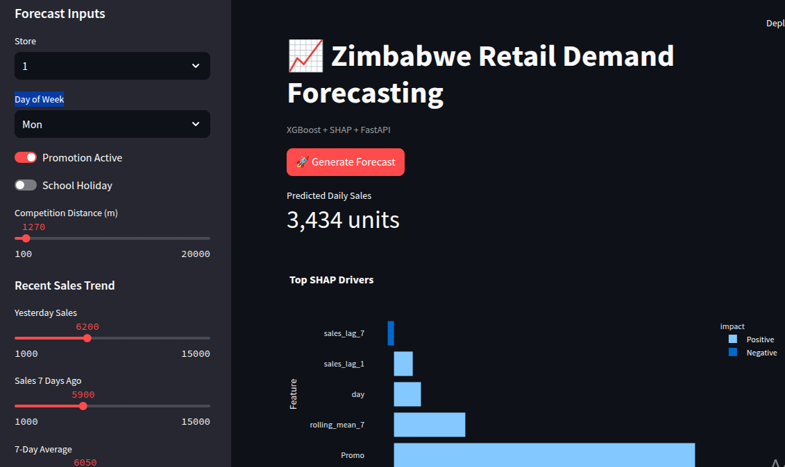
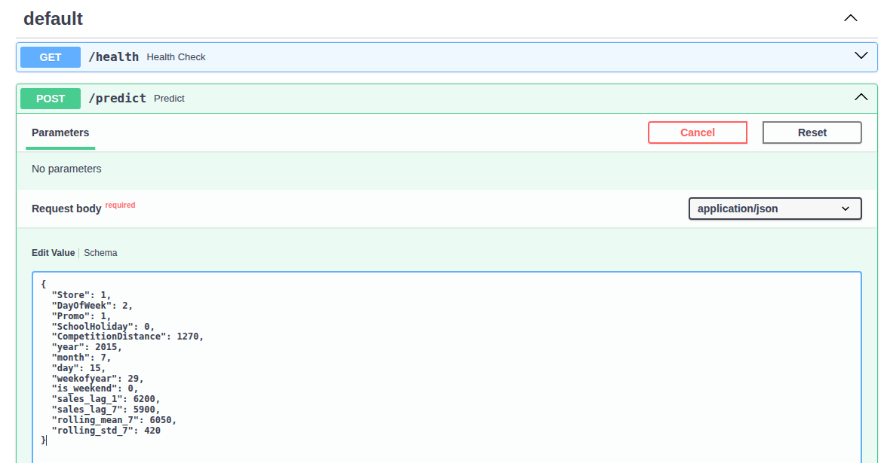

# Zimbabwe Retail Demand Forecasting Platform

An end-to-end ML forecasting platform that predicts daily retail sales and explains the forecast using SHAP. Built with XGBoost, FastAPI, Streamlit, Docker, MLflow, and GitHub Actions.

## Business Problem

Retailers often rely on spreadsheets and intuition to decide how much stock to order next week. Poor forecasts lead to:
* Stockouts
* Excess inventory
* Lost sales
* Higher holding costs

This project demonstrates a production-style ML system that predicts store demand and provides explainable drivers behind each forecast.

## Key Results

* **Baseline MAE:** 2,422.84
* **XGBoost MAE:** 653.86
* **Forecast improvement:** 73% reduction in error

## Architecture

Streamlit UI → FastAPI → XGBoost + SHAP → JSON Response

```text
┌─────────────────────┐
│   Streamlit UI      │
│  (Port 8501)        │
└──────────┬──────────┘
           │ HTTP POST
           ▼
┌─────────────────────┐
│   FastAPI Backend   │
│   /predict          │
│   /health           │
└──────────┬──────────┘
           │
     ┌─────┴─────┐
     ▼           ▼
┌─────────┐ ┌─────────┐
│XGBoost  │ │  SHAP   │
│Forecast │ │Explain  │
└────┬────┘ └────┬────┘
     └─────┬─────┘
           ▼
┌─────────────────────┐
│  JSON Response      │
│ Forecast + Drivers  │
└─────────────────────┘
```

## Demo

### Dashboard


### API Documentation



## Tech Stack

| Layer | Technology |
|---|---|
| **Frontend** | Streamlit |
| **Backend API** | FastAPI |
| **ML Model** | XGBoost |
| **Explainability** | SHAP |
| **Experiment Tracking** | MLflow |
| **Containerization** | Docker + Docker Compose |
| **CI/CD** | GitHub Actions |
| **Testing** | Pytest |

## Features

* Interactive sales forecasting dashboard
* Real-time API predictions
* SHAP feature attribution
* MLflow experiment tracking
* Dockerized microservice architecture
* Automated CI pipeline

## Quick Start

**1. Clone the repository**
```bash
git clone https://github.com/SimbaMunatsi/zimbabwe-retail-forecast.git
cd zimbabwe-retail-forecast
```

**2. Run with Docker**
```bash
docker compose up --build
```

**3. Open the applications**
* **Dashboard:** `http://localhost:8501`
* **API Docs:** `http://localhost:8000/docs`
* **Health Check:** `http://localhost:8000/health`

## Example API Request

```json
{
  "Store": 1,
  "DayOfWeek": 2,
  "Promo": 1,
  "SchoolHoliday": 0,
  "CompetitionDistance": 1270,
  "year": 2015,
  "month": 7,
  "day": 15,
  "weekofyear": 29,
  "is_weekend": 0,
  "sales_lag_1": 6200,
  "sales_lag_7": 5900,
  "rolling_mean_7": 6050,
  "rolling_std_7": 420
}
```

## Example Response

```json
{
  "forecast": 7118.03,
  "top_contributors": [
    {"feature": "Promo", "shap_value": 2450.17},
    {"feature": "DayOfWeek", "shap_value": -1211.07},
    {"feature": "rolling_mean_7", "shap_value": 859.30}
  ],
  "model_version": "xgboost_v1"
}
```

## CI/CD

Every push triggers GitHub Actions to:
* Install dependencies
* Run the Pytest suite
* Validate API behavior
* Verify data logic

## Project Structure

```text
api/              # FastAPI service
src/              # ML pipeline
models/           # Serialized artifacts
tests/            # Pytest suite
.github/workflows # CI pipeline
app.py            # Streamlit dashboard
```

## Future Improvements

* Multi-store forecasting horizon
* Automated model retraining
* Drift monitoring
* Cloud deployment with autoscaling
* Forecast scheduling with Airflow

## Author

**SimbaraShe Munatsi**
AI / ML Engineer | FastAPI | MLOps | Explainable AI